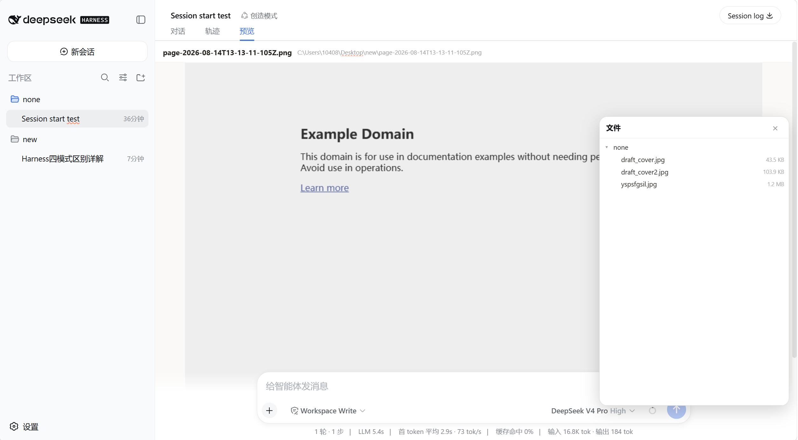

# 📂 dsh-file-explorer

> 给 **DeepSeek Harness** 的纯文本 Agent 装上一个「文件浏览器」。
> 一个右下角的浮动文件树，加一个与「对话」「轨迹」**平级**的预览/编辑页签——浏览工作区目录、预览文本和图片，
> 还能**直接编辑文本文件**、**把文件直接拖进消息框**（自动插入文件路径），并支持**新建文件**与**删除文件**，无需切出对话。

<p align="center">
  
</p>

## ✨ 为什么用它

纯文本模型(如 DeepSeek)没法直接「看」文件。这个插件把文件浏览和预览收进 Harness 界面里：

- 📁 **浮动文件树** — 右下角一个按钮，点开即浏览当前工作区的目录树，可逐层展开
- 🗂️ **预览/编辑页签** — 点文件后，切到对话区顶部的「预览/编辑」页签(与「对话」「轨迹」并排)查看内容，不打断对话流
- ✏️ **文件编辑** — 文本文件可直接在预览页签中编辑，支持保存(Ctrl+S)、撤销(Ctrl+Z)、重做(Ctrl+Y)
- 🎯 **拖拽进消息框** — 把文件树里的文件(或目录)直接拖到消息输入框，松开即插入该文件的绝对路径，
  Agent 收到后可直接用 `read` 等工具读取，不用手动敲路径
- ➕ **新建文件** — 面板头部「＋」在树根(当前工作区)新建;**悬停任意目录行**再点「＋」，直接在该目录内新建
  (自动展开该目录，表单出现在其子项顶部)
- 🗑️ **删除文件/文件夹** — 悬停行出现删除按钮，点击弹出**DSH 原生风格的确认弹窗**(ui-primitives 的 `Modal`/`Button`，
  非浏览器原生 confirm；遮罩/圆角/文案全走 `--dsw-*` 设计 token，明暗主题自适应)。删除**文件夹**走更强的
  `RiskConfirmation`：必须勾选「我了解此操作不可撤销」才能确认，确认后**递归删除**整个目录；
  服务端始终拒绝删除文件系统根路径，未带递归标志时拒绝非空目录，防误删
- 🔄 **实时跟随工作区** — 文件树根路径跟随当前会话的 `cwd`，切换工作区立即刷新
- ✨ **丝滑动效** — 面板开合弹出/收缩、新建表单滑入、弹窗卡片缩放入场、行 hover 渐变，
  全部走 DSH 动效 token(`--ds-ease-in-out` + 0.1/0.2/0.3s 时长档)，并尊重系统「减弱动态效果」设置
- 🔒 **安全** — 同源校验 + 路径规范化 + 条目/字节上限；删除操作拒绝非空目录与文件系统根路径，新建拒绝重名覆盖(409)

## 🚀 快速开始

需要 DeepSeek Harness 的 Web profile 和 `pnpm`：

```sh
# 1. 克隆仓库
git clone https://github.com/cxzrdxy/dsh-file-explorer.git
cd dsh-file-explorer

# 2. 安装到 web profile（本地路径）
dsh plugin --profile web add file:.
```

重启 Web profile 即可。包内已提交编译好的 `lib/`，从 checkout 安装不需要消费端构建。

**使用**：

1. 点右下角 📁 按钮 → 打开文件树
2. 点某个文件 → 弹出提示「已打开「文件名」」
3. 点对话区顶部页签栏的「**预览/编辑**」→ 查看内容
4. 点「**编辑**」按钮 → 进入编辑模式，可直接编辑文本文件
5. 编辑完成后点「**保存**」或按 Ctrl+S → 保存文件
6. 或直接把文件树里的文件**拖到消息输入框** → 松开后文件路径自动插入消息文本，发送即可让 Agent 读取
7. 点面板头部「**＋**」→ 输入文件名回车 → 在工作区根目录新建文件
8. **悬停某个目录行** → 点该行右侧「＋」→ 在该目录内新建文件(目录自动展开)
9. 悬停某个文件行 → 点「🗑」→ 确认后删除该文件
10. **悬停某个目录行**(树根除外) → 点「🗑」→ 勾选确认后**递归删除**该文件夹

## 📦 可预览的文件类型

| 类型 | 扩展名 | 大小上限 |
|---|---|---|
| 📄 文本 | `.txt` `.md` `.markdown` `.json` `.js` `.ts` `.tsx` `.jsx` `.css` `.html` `.htm` `.yml` `.yaml` `.xml` `.csv` `.log` `.py` `.c` `.cpp` `.h` `.cs` `.java` `.go` `.rs` `.sh` `.ps1` `.sql` `.ini` `.cfg` `.toml` `.bat` `.cmd` | 512 KB |
| 🖼️ 图片 | `.png` `.jpg` `.jpeg` `.gif` `.webp` `.bmp` `.svg` `.ico` | 8 MB |
| ⚠️ 其他 | 二进制文件 → 显示大小提示，不预览内容 | — |

超出大小上限的文件会显示「文件过大」提示，不会被读取。

## 🏗️ 架构

单一 bundle 包，node half + browser half 同包(参照 `@dsh-external/dsh-vision-toolkit`)：

| 半 | 文件 | 作用 |
|---|---|---|
| node half | `lib/index.js` / `src/index.ts` | 同源文件 API(`list`/`read`/`workspace` GET，`create`/`delete` POST)+ HTTP 路由 `/_dsh/file-explorer/api` |
| browser half | `lib/client.js` / `src/client/*` | 文件树(`shell.overlay`，含新建/删除 UI)+ 预览页签(`conversation.view`)+ 消息框拖放目标(`conversation.input.overlay`) |

文件树与预览页签通过 `src/client/filePreviewStore.ts` 模块级单例共享「当前预览文件」；
拖放目标 `src/client/FileDropZone.tsx` 经 ui-conversation 标准套件提供的 `inputActions.setDraft`
把拖入的文件路径写入消息草稿(路径经自定义 DataTransfer MIME `application/x-dsh-file-path` 传递)。

## 🔧 二次开发

源码随包提交，但 **client bundle 的编译依赖 DSH 源码树**(`packages/client/tsdown.client.ts` 的 `clientBundle()` 预设，以及 `@deepseek-ai/dsh-client-*` 的 workspace 类型)。要重新构建：

1. 把 `src/` 放回一个 DeepSeek Harness checkout(host 半放 `packages/host/`、client 半放 `packages/client/ui-file-explorer/`)
2. 在 checkout 内运行 `pnpm install` + `tsc -b` + `tsdown bundle`
3. 把 `lib/client.js`、`lib/index.js` 覆盖回本包

## ⚠️ 已知限制

- 预览页签需**手动切换**(点文件后点「预览/编辑」页签)。自动跳转需要访问 `ui-conversation` 内部的 view store，当前 DSH 架构未对外暴露该能力
- 拖拽进消息框**仅支持从文件树节点拖出**(浏览器拿不到 OS 文件管理器中文件的绝对路径，`File` 对象不含 path)
- **树根目录(当前工作区)本身不可删除**(行上不显示删除按钮，防清空工作区)

## 📄 License

MIT
